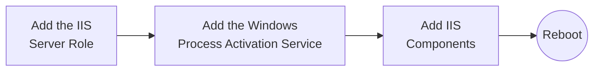
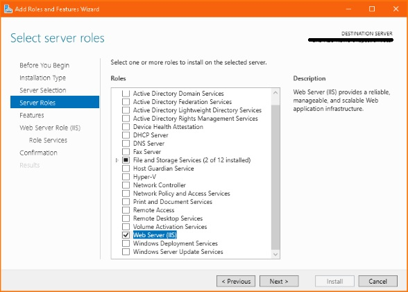
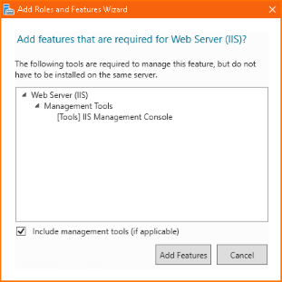
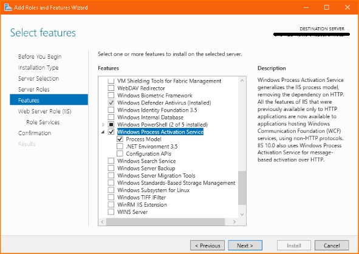
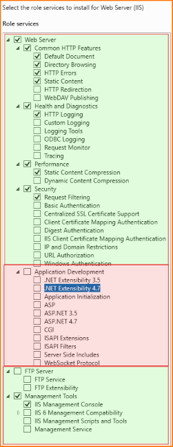
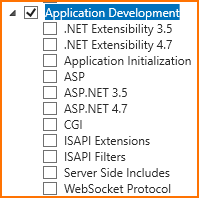
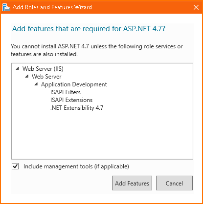
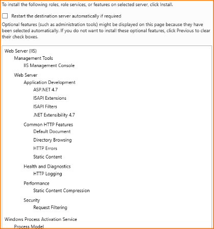

<!-- 260505 -->

[The Documentation Project](../README.md) ❭ Applications ❭ Internet Information Services

***

### The Documentation Project

  <picture>
    <source media="(prefers-color-scheme: dark)" srcset="../../../.github/repository/logo/apcp-logo-dark-256x256.png">
    <source media="(prefers-color-scheme: light)" srcset="../../../.github/repository/logo/apcp-logo-light-256x256.png">
    
  </picture>

# Internet Information Services

# Installing Microsoft Internet Information Services

1. Launch the **Server Manager** application
2. Under **Server Roles**, check the box next to **Web Server (IIS)**

  

3. If a popup suggests you include the *IIS Mangement Console* tools, checked, then click ***Add Features***

  

4. Under **Features**, add the **Windows Process Activation Service**

  

5. Under **Web Server Role (IIS) > Role Services**, verify that the components highlighted green are set properly

  

6. Under **Web Server Role (IIS) > Role Services**, check **Application Development**

  

7. In the **Application Development** section, check the following *in this order*:

* **ISAPI Filters**
* **ISAPI Extensions**
* **.NET Extensibility 4.7**
* **ASP.NET 4.7**

  

> [!NOTE]
> If you didn't follow the order above, you may get a popup letting you know that required features are missing. Just click ***Add Features***, and continue.

8. Click ***Next***, and you should see the confirmation screen:

  

9. Click ***Install***
10. Once the installation is complete, click ***Close***

## Reboot

If you checked the *Restart the destination server automatically if required* box on the confirmation screen, the server should reboot automatically.

If the server does not reboot automatically, reboot manually.

***

[The Documentation Project](../README.md) ❭ Application ❭ Internet Information Services
