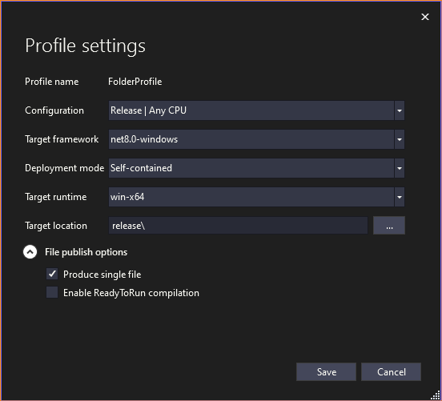

[🏠︎](README.md) ❭ Applications > Visual Studio 2026

<div align="center">

### The Documentation Project

  <picture>
    <source media="(prefers-color-scheme: dark)" srcset="../../../.github/repository/logo/apcp-logo-dark-256x256.png">
    <source media="(prefers-color-scheme: light)" srcset="../../../.github/repository/logo/apcp-logo-light-256x256.png">
    
  </picture>

# Visual Studio 2026

</div>

| CONTENTS |
| -------- |
| [Setup](#setup) |
| [Extensions](#extensions) |
| [Configure](#configure) |
| [Publishing](#publishing) |

## Setup

Installing Visual Studio 2026 is pretty straight forward, just download the [installer](https://visualstudio.microsoft.com/vs/) and follow the prompts.

### Visual Studio Workflows

The bulk of the install process is choosing the workflows you will need for development.

For example, I've installed the following workflows for developing web services using C#:

* ASP.NET and web development
* Azure Development
* .NET desktop development

## Extensions

To install an extension:

1. Go to `Extensions -> Manage Extensions...`
2. Click the `Browse` tab
3. Search for the extension name
4. Click "Install"

## Recommended extensions

### Mads Kristensen extensions

[Mads Kristensen](https://www.madskristensen.net/) is a Principal Product Manager for Visual Studio, and has made some awesome extensions:

* [Add New File (64-bit)](https://marketplace.visualstudio.com/items?itemName=MadsKristensen.AddNewFile64)
* [Clean Solution](https://marketplace.visualstudio.com/items?itemName=MadsKristensen.CleanSolution)
* [Code Cleanup On Save](https://marketplace.visualstudio.com/items?itemName=MadsKristensen.CodeCleanupOnSave)
* [Color Preview](https://marketplace.visualstudio.com/items?itemName=MadsKristensen.ColorPreview)
* [Copy Nice](https://marketplace.visualstudio.com/items?itemName=MadsKristensen.CopyNice)
* [Comment Remover](https://marketplace.visualstudio.com/items?itemName=MadsKristensen.CommentRemover)
* [Editor Enhancements](https://marketplace.visualstudio.com/items?itemName=MadsKristensen.EditorEnhancements64)
* [Editor Info](https://marketplace.visualstudio.com/items?itemName=MadsKristensen.DocumentMargin)
* [File Differ](https://marketplace.visualstudio.com/items?itemName=MadsKristensen.FileDiffer)
* [File Explorer](https://marketplace.visualstudio.com/items?itemName=MadsKristensen.WorkflowBrowser)
* [File Icons](https://marketplace.visualstudio.com/items?itemName=MadsKristensen.FileIcons)
* [Font Sizer 2.0](https://marketplace.visualstudio.com/items?itemName=MadsKristensen.FontSizer2)
* [Image Optimizer (64-bit)](https://marketplace.visualstudio.com/items?itemName=MadsKristensen.ImageOptimizer64bit)
* [Image Preview](https://marketplace.visualstudio.com/items?itemName=MadsKristensen.ImagePreview)
* [JSON Schema Tools](https://marketplace.visualstudio.com/items?itemName=MadsKristensen.JSONSchemaGenerator2)
* [KnownMonikers Explorer (64 bit)](https://marketplace.visualstudio.com/items?itemName=MadsKristensen.KnownMonikersExplorer2022)
* [Markdown Editor v2](https://marketplace.visualstudio.com/items?itemName=MadsKristensen.MarkdownEditor2)
* [Open Command Line](https://marketplace.visualstudio.com/items?itemName=MadsKristensen.OpenCommandLine64)
* [Open in Visual Studio Code](https://marketplace.visualstudio.com/items?itemName=MadsKristensen.OpeninVisualStudioCode)
* [Output Window Filter](https://marketplace.visualstudio.com/items?itemName=MadsKristensen.OutputWindowFilter)
* [Show Selection Length](https://marketplace.visualstudio.com/items?itemName=MadsKristensen.ShowSelectionLength)
* [Solution Colors](https://marketplace.visualstudio.com/items?itemName=MadsKristensen.SolutionColors)
* [Solution Favorites](https://marketplace.visualstudio.com/items?itemName=MadsKristensen.SolutionFavorites)
* [Syntax Booster Pack](https://marketplace.visualstudio.com/items?itemName=MadsKristensen.LanguagePack&ssr=false#overview)
* [Trailing Whitespace Visualizer](https://marketplace.visualstudio.com/items?itemName=MadsKristensen.TrailingWhitespace64)
* [Tweaks 2022](https://marketplace.visualstudio.com/items?itemName=MadsKristensen.Tweaks2022)
* [Voice Typing](https://marketplace.visualstudio.com/items?itemName=MadsKristensen.Speak)

There are a few themes as well:

* [Dark Theme (2019)](https://marketplace.visualstudio.com/items?itemName=MadsKristensen.GitHubThemes)
* [GitHub Themes](https://marketplace.visualstudio.com/items?itemName=MadsKristensen.GitHubThemes)
* [Original Blue Theme](https://marketplace.visualstudio.com/items?itemName=MadsKristensen.BlueColorTheme)
* [Winter is Coming](https://marketplace.visualstudio.com/items?itemName=MadsKristensen.WinterIsComing)

### Microsoft/Microsoft DevLabs extensions

Official extensions and themes from Microsoft.

* [SlowCheetah](https://marketplace.visualstudio.com/items?itemName=vscps.SlowCheetah-XMLTransforms-VS2022)
* [Visual Studio Theme Pack](https://marketplace.visualstudio.com/items?itemName=idex.vsthemepack)
* [Visual Studio 25th Anniversary Theme Pack](https://marketplace.visualstudio.com/items?itemName=idex.vsanniversarythemepack)

### Other extensions

* [Avalonia](https://marketplace.visualstudio.com/items?itemName=AvaloniaTeam.AvaloniaVS)
* [Claudia IDE](https://marketplace.visualstudio.com/items?itemName=kbuchi.ClaudiaIDE)
* [Collapse Comments](https://marketplace.visualstudio.com/items?itemName=MattLaceyLtd.CollapseComments)
* [CopyFolderTree](https://marketplace.visualstudio.com/items?itemName=iyulab.CopyFolderTree)
* [Editor Guidelines](https://marketplace.visualstudio.com/items?itemName=PaulHarrington.EditorGuidelinesPreview)
* [Extended XML Doc Comments Provider](https://marketplace.visualstudio.com/items?itemName=EWoodruff.ExtendedDocCommentsProvider2022)
* [Json Formatter](https://marketplace.visualstudio.com/items?itemName=KentonStandard.JsonFormatter)
<!-- - [JSON Pretty](https://marketplace.visualstudio.com/items?itemName=Hemax2000.JsonPretty) -->
* [Roslynator 2022](https://marketplace.visualstudio.com/items?itemName=josefpihrt.Roslynator2022)
* [SolutionMapper](https://marketplace.visualstudio.com/items?itemName=TJGokken.solmap2025)
* [Spell Check My Code](https://marketplace.visualstudio.com/items?itemName=EWoodruff.VisualStudioSpellCheckerVS2022andLater)
<!--  - [VSColorOutput64](https://marketplace.visualstudio.com/items?itemName=MikeWard-AnnArbor.VSColorOutput64) -->
* [XAML Styler for Visual Studio 2022](https://marketplace.visualstudio.com/items?itemName=TeamXavalon.XAMLStyler2022)

### Themes

Themes/color schemes/etc. are a personal choice. I use these:

* [Dracula Official](https://marketplace.visualstudio.com/items?itemName=dracula-theme.dracula)
* [Synthwave '84 Reborn](https://marketplace.visualstudio.com/items?itemName=Fasteroid.Synthwave84VS)

## Configure

### Tools > Options > All Settings
These settings are found in **Tools** > **Options** > **All Settings**

#### Environment

* **Visual Experience** > **Color Theme**: `Dracula Theme`
* **Documents** > Uncheck `Show Miscellaneous files...`
* **Tabs** > **Tab colorization method**: `Project`
* **Tabs** > Check `Maintain pin status...`
* **Task List** >

The task list should look like this:

| Name        | Priority |  
| ----------- | -------- |  
| DEPRECIATED | Normal   |  
| DEVNOTE     | Normal   |  
| REVIEW      | Normal   |  

* **Import and Export Settings** > Modify the `Automatically save my settings...` location

#### Projects and Solutions

* **Locations** > Modify `Project location` location

#### Text Editor

* **Display** > Check `Show whitespace`
* **Display** > Check `Show zero-width characters`

#### Languages

See the [C#](#c) section.

## ClaudiaIDE


### Pretty Doc Comments

* **Code Font**: `Cascadia Mono`
* **Default Font**: `Cascadia Code`
* **Collapse Comments to Summary**: `True`

### Components that are not modified

The following setting components are not modified in any way:

* Preview Features (as of [v18.0.1](./img/vs2026-18.0.1-preview-features.png))
* .NET MAUI
* Azure Data Lake
* Azure Service Authentication
* Collapse Comments
* Container Tools
* Cross Platform
* Database Tools
* Debugging
* F# Tools
* GitHub
* GitHub Copilot for Azure
* IntelliCode
* NuGet Package Manager
* Roslynator
* Source Control
* SQL Server Tools
* Test
* Text Templating
* VSColorOutput64
* Web
* Web Performance Test Tools
* Windows Form Designer
* WSL Debugging for .NET
* XAML Designer
* XAML Styler

### Editor Guidelines

1. Go to `Tools > Options > Environment > Fonts and Colors`
2. Choose `Guideline` from the *Display Items* list
3. Pick a color you like!

### All Settings > Environment > Task List

The task list should be:

* DEPRECIATED
* DEVNOTE
* REVIEW

## Publishing

How to publish as a single file:

1. Right-click on the project you want to publish, and choose "Publish"
2. Click "Add a publish profile"
3. For the Target, choose "Folder"
4. Choose the Specific target, choose "Folder"
5. Choose a folder location to publish to.

For example:

`release\`

6. Click "Close"
7. Click "Show all settings"

WPF projects should look like this:



Console projects should look like this:


8. Click "Save".

9. Add the following to the .csproj file:

```csharp
<PropertyGroup>
    <DebugType>embedded</DebugType>
    <IncludeAllContentForSelfExtract>true</IncludeAllContentForSelfExtract>
    <Version>1.0.0</Version>
    <FileVersion>1.0.0</FileVersion>
</PropertyGroup>
```

### Multi-project solutions

If a solution has multiple projects, each project needs to be published.

# More

https://learn.microsoft.com/en-us/dotnet/core/deploying/

***

[🏠︎](README.md) ❭ Applications > Visual Studio 2026

<sub>Last updated: 260603</sub>
