[The Documentation Project](../../README.md) ❭ Applications ❭ Visual Studio 2026 ❭ Configure Visual Studio 2026

### The Documentation Project

  <picture>
    <source media="(prefers-color-scheme: dark)" srcset="../../../.github/logo/dark/256x256.png">
    <source media="(prefers-color-scheme: light)" srcset="../../../.github/logo/light/256x256.png">
    
  </picture>

# Configure Visual Studio 2026 (18.7.3)

| CONTENTS |
| -------- |
| [All Settings](#all-settings) |
| [Extensions](#extensions) |

## All Settings

Environment

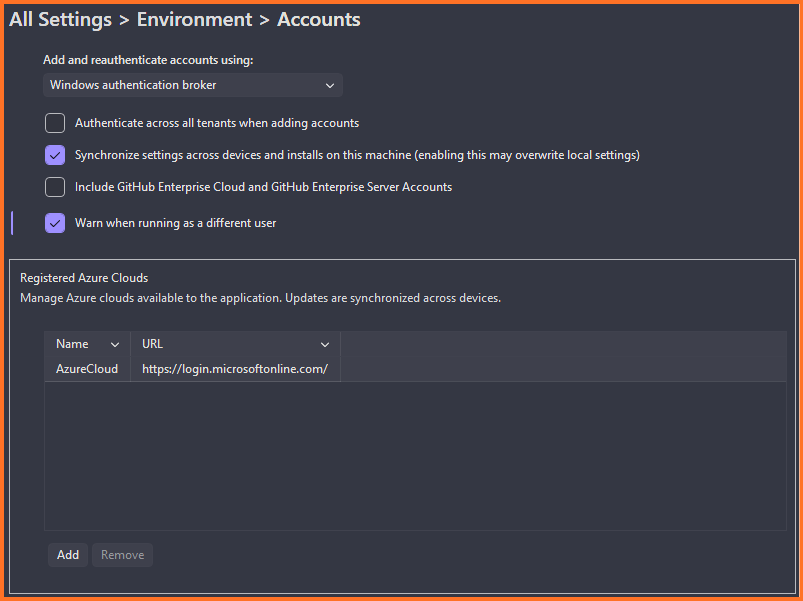

**Environment > Clean Solution**
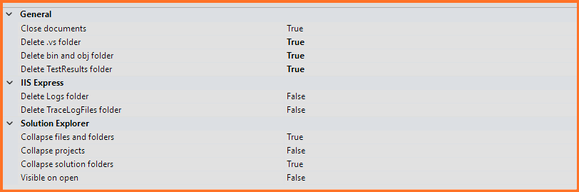
**Environment > Code Cleanup On Save**
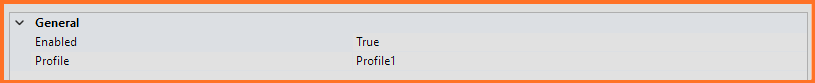
**Environment > Command Line**
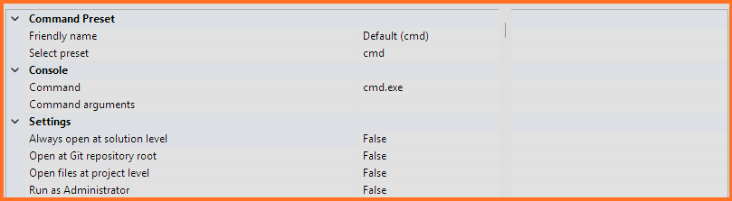
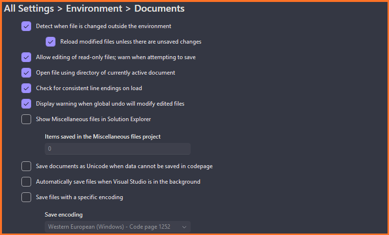
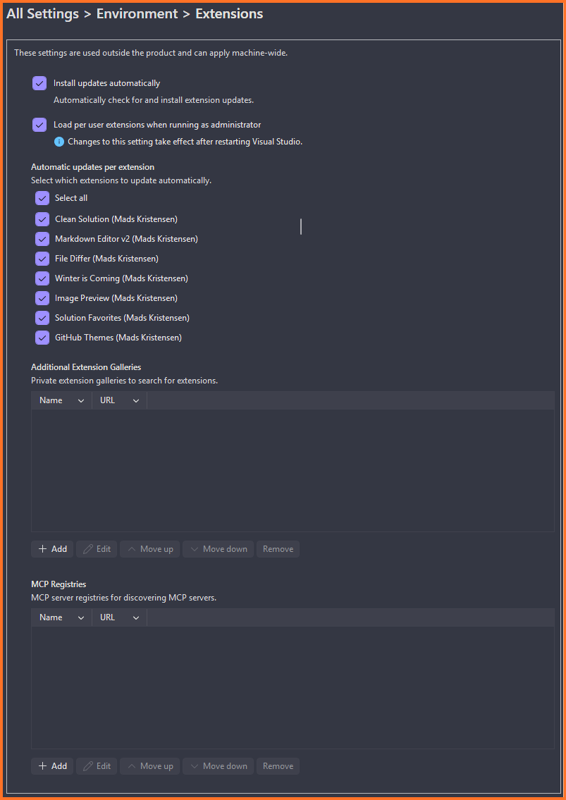
**Environment > Fonts and Colors**
***NFORMATION SOON***
**Environment > Import and Export Settings**
Modify this for your development environment.

**Environment > Fonts and Colors**
***NO CHANGES***
**Environment > Product Updates**

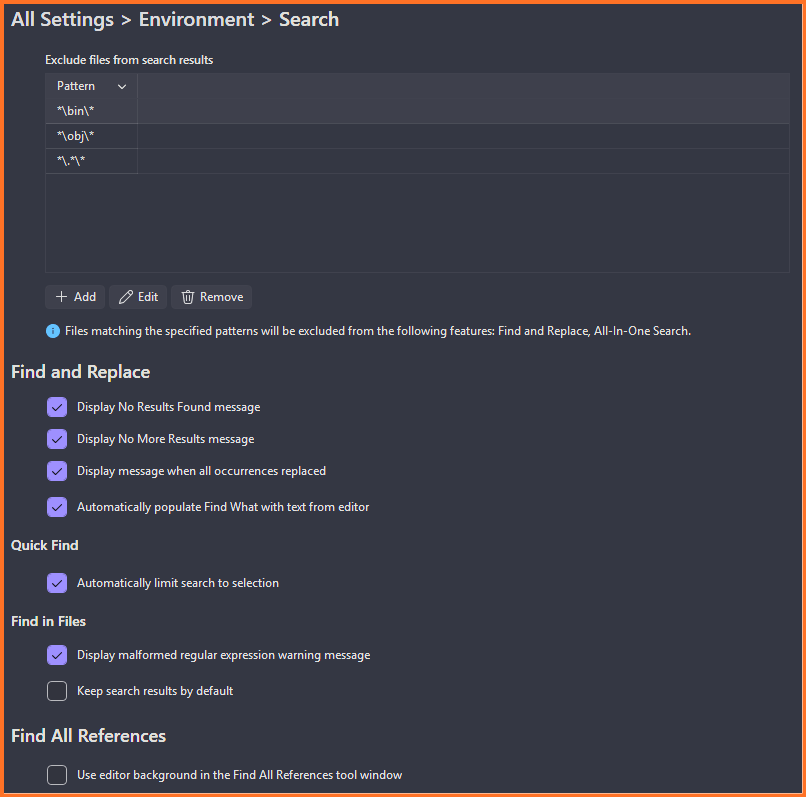

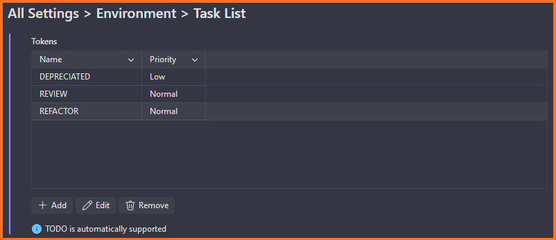
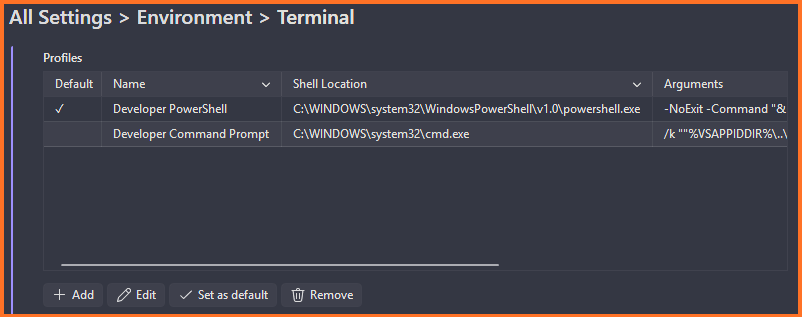
**Environment > Trailing Whitespace**
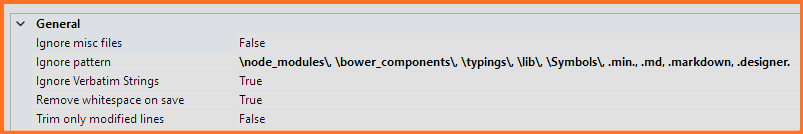
**Environment > Tweaks 2022**
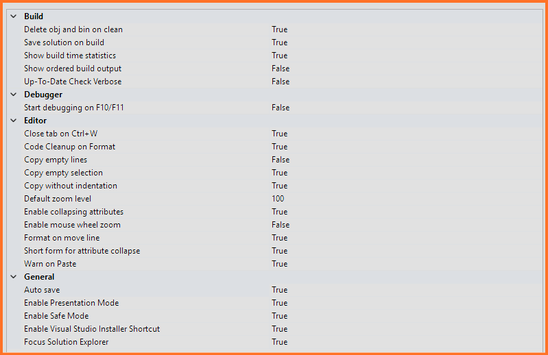
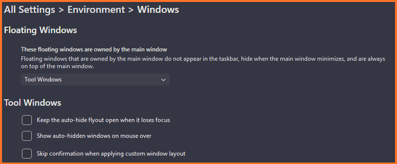

Tools > Options > All Settings

### Environment

* **Visual Experience** > **Color Theme**: `Dracula Theme`
* **Documents** > Uncheck `Show Miscellaneous files...`
* **Tabs** > **Tab colorization method**: `Project`
* **Tabs** > Check `Maintain pin status...`
* **Task List** >

The task list should look like this:

| Name        | Priority |  
| ----------- | -------- |  
| DEPRECIATED | Normal   |  
| DEVNOTE     | Normal   |  
| REVIEW      | Normal   |  

* **Import and Export Settings** > Modify the `Automatically save my settings...` location

### Projects and Solutions

* **Locations** > Modify `Project location` location

### Text Editor > General

* **Display** > Check `Show whitespace`
* **Display** > Check `Show zero-width characters`

### Languages > C#

* **Scroll Bars** > Vertical scroll bar mode: `Map mode`
* **Scroll Bars** > Source overview width: `Narrow`

## ClaudiaIDE

### Pretty Doc Comments

* **Code Font**: `Cascadia Mono`
* **Default Font**: `Cascadia Code`
* **Collapse Comments to Summary**: `True`

### Editor Guidelines

1. Go to `Tools > Options > Environment > Fonts and Colors`
2. Choose `Guideline` from the *Display Items* list
3. Pick a color you like!

## Extensions

If you installed any of the [recommended extensions](Extensions.md), you may want to configure them to your liking.

***

[The Documentation Project](../../README.md) ❭ Applications ❭ Visual Studio 2026 ❭ Configure Visual Studio 2026

Last updated: 260713
