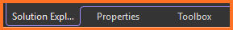
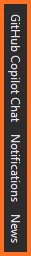
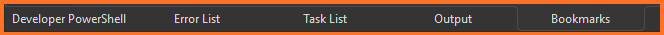

[The Documentation Project](../../README.md) ❭ Applications ❭ Visual Studio 2026 ❭ Customize Visual Studio 2026

### The Documentation Project

  <picture>
    <source media="(prefers-color-scheme: dark)" srcset="../../../.github/logo/dark/256x256.png">
    <source media="(prefers-color-scheme: light)" srcset="../../../.github/logo/light/256x256.png">
    
  </picture>

# Customize Visual Studio 2026

## Left

## Right

## Bottom

  
***

[The Documentation Project](../../README.md) ❭ Applications ❭ Visual Studio 2026 ❭ Customize Visual Studio 2026

Last updated: 260714
