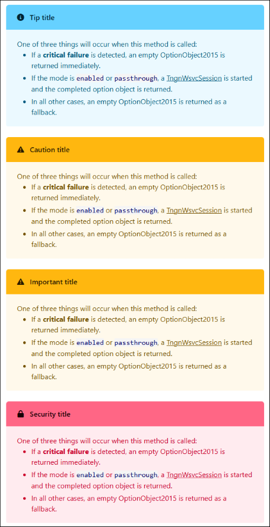
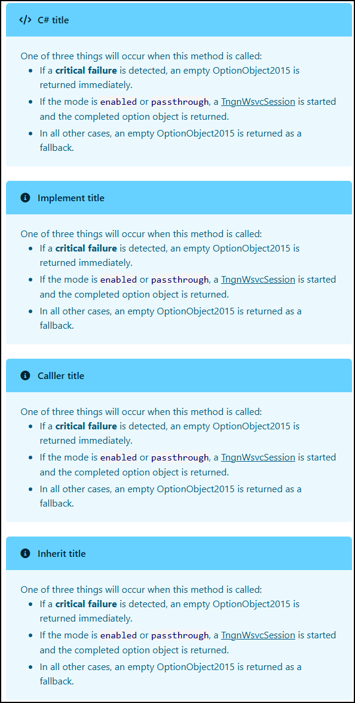

[🏠︎](README.md) ❭ Documentation > C# XML Documentation

<div align="center">

### The APCP Documentation Project

  <picture>
    <source media="(prefers-color-scheme: dark)" srcset="../../.github/Repository/Logo/apcp-logo-dark-256x256.png">
    <source media="(prefers-color-scheme: light)" srcset="../../.github/Repository/Logo/apcp-logo-light-256x256.png">
    
  </picture>

# C# XML Documentation

</div>

| CONTENTS                                                                              |
|:--------------------------------------------------------------------------------------|
| [Guidelines](#guidelines)                                                             |
| [Documentation Tags](#documentation-tags)                                             |
| [Text formatting](#text-formatting)                                                   |
| [Callouts](#callouts)                                                                 |
| [Example of well-formed XML documentation](#example-of-well-formed-xml-documentation) |
| [External documentation](#external-documentation)                                     |
| [Example of external XML documentation](#example-of-external-xml-documentation)       |
| [Additional information](#additional-information)                                     |

---

C# source files can include structured comments that produce API documentation for the types defined in those files. The C# compiler produces an XML file that contains structured data representing the comments and the API signatures. Other tools can process that XML output to create human-readable documentation in the form of web pages or PDF files, for example.

The C# language reference documents the most recently released version of the C# language. It also contains initial documentation for features in public previews for the upcoming language release.

---

## Guidelines

> [!NOTE]
> The majority of these guidelines are implemented in the [`xml-documentation-agent.md`](https://github.com/APrettyCoolProgram/Repository-Template/blob/main/.github/agents/xml-documentation-csharp-agent.md) file.

### Required

All XML documentation must:

- Be well-formed XML
- Not exceed 120 characters (where practical)
- Use concise wording

### What to document

These members must be documented:

- `types`
- `constructors`
- `methods`
- `properties`
- `indexers`
- `fields` (when explicitly requested or when they are part of the documented API)

### Event Handlers

Skip documentation for methods that are clearly event handlers or UI callbacks, including methods that:

- match common event-handler signatures such as `(object? sender, EventArgs e)`
- are wired directly to UI events
- are clearly intended only as framework callbacks

Do not skip a method solely because its name starts with `On`.

## Documentation Tags

### Rules

- Every documented type and member must have a `<summary>` tag.
- Every documented method and constructor parameter must have a matching `<param>` tag.
- Every documented generic type or method must document each type parameter with `<typeparam>`.
- Every documented non-`void` method must have a `<returns>` tag.
- Properties and indexers should include a `<value>` tag when it adds useful meaning.
- Use `<remarks>` only when extra context is useful.
- Use `<example>` only when the member would clearly benefit from a usage example.
- Use `<exception>` only for exceptions explicitly thrown by the member implementation.

### Formatting

- Place opening and closing tags on separate lines for multi-line blocks.
- Break lines at logical sentence boundaries.
- Prefer `<br/>` over `<para>` when a simple line break is needed.
- Indent `<code>` contents for readability, but do not otherwise change file formatting.

### Single-line

Prefer single-line form for these tags unless the content clearly requires multiple lines:

- `<summary>`
- `<typeparam>`
- `<param>`
- `<returns>`
- `<value>`

### Multi-line

Use multi-line blocks for these tags when present:

- `<remarks>`
- `<example>`
- `<exception>`

### Inline

Use these inline tags where appropriate:

- `<c>` for inline code
- `<see cref="..."/>` for symbols in the current compilation
- `<see href="...">...</see>` for external links
- `<paramref name="..."/>` for parameter references
- `<typeparamref name="..."/>` for generic type parameter references

### Order

When a tag is used, apply this order:

1. `<summary>`
2. `<remarks>`
3. `<typeparam>`
4. `<param>`
5. `<returns>`
6. `<value>`
7. `<example>`
8. `<exception>`
9. `<seealso>`

## Text formatting

### Emphasis

XML documentation can using the following HTML formatting tags to emphasize text:

- `<b>bold</b>`
- `<i>italic</i>`
- `<u>underline</u>`

### Special characters

Special XML characters must be escaped using the following escape sequences:

| Character | Escape Sequence |
|-----------|-----------------|
| `<`       | `&lt;`          |
| `>`       | `&gt;`          |
| `&`       | `&amp;`         |
| space     | `&nbsp;`        |

### Lists

#### Bulleted list

Bulleted lists should follow these guidelines:

- All items (including tags) should fit on a single line
- It is recommended that item text not exceed 85 characters, and should not exceed 120 characters
- Items should not end, or contain, periods
- Proper indenting should be used

```xml
An introduction:
<list type="bullet">
<item>Bullet 1</item>
<item>Bullet 1</item>
<item>Bullet 1</item>
</list>
```

### Numbered list

TBA

### Tables
Tables should follow these guidelines:

- An optional `listheader` may be used
- All items (including tags) should fit on a single line
- It is recommended that item text not exceed 85 characters, and should not exceed 120 characters
- Items should not end, or contain, periods
- Proper indenting should be used

```xml
<para>
An introduction:
<list type="table">
<listheader>
<term>Term header</term>
<description>Description header</description>
</listheader>
<item>
<term>Term 1</term>
<description>Description 1</description>
</item>
<item>
<term>Term 2</term>
<description>Description 3</description>
</item>
</list>
</para>
```

## Callouts

Callouts are a type of note that can be included in XML documentation to provide additional information, warnings, tips, or other contextual details. They are typically used to highlight important points or provide extra guidance to developers who are reading the documentation.

```xml
<note>
This example demonstrates the handling of a <c>note</c> element with no
defined type. It defaults to the "note" style.
</note>
<note type="tip">
A <c>tip</c> callout.
</note>
<note type="tip" title="Custom title">
A <c>tip</c> callout with a custom title.
</note>
<note type="caution">
A <c>caution</c> callout.
</note>
<note type="important">
An <c>important</c> callout.
</note>
<note type="security">
A <c>security</c> callout.
</note>
<note type="C#">
A <c>C#</c> callout.
</note>
<note type="implement">
For implementers.
</note>
<note type="caller">
For callers.
</note>
<note type="inherit">
For inheritors.
</note>
```

### What they look like

|                                                    |                                                    |
|----------------------------------------------------|----------------------------------------------------|
|  |  |

## Example of well-formed XML documentation

This is an example of well-formed XML documentation comments for a method:

```xml
/// <summary>Saves the current document to the specified file path.</summary>
/// <remarks>
/// This method validates <paramref name="filePath"/> before attempting to save.<br/>
/// It does not create parent directories automatically.
/// </remarks>
/// <param name="filePath">The full path of the destination file.</param>
/// <returns><see langword="true"/> if the document is saved successfully; otherwise, <see langword="false"/>.</returns>
/// <example>
/// <code>
/// if (editor.Save(@"C:\Temp\note.txt"))
/// {
///     Console.WriteLine("Save completed.");
/// }
/// </code>
/// </example>
/// <exception cref="System.ArgumentException">
/// Thrown when <paramref name="filePath"/> is empty or consists only of whitespace.
/// </exception>
/// <seealso href="https://learn.microsoft.com/dotnet/csharp/language-reference/xmldoc/"/>
public bool Save(string filePath)
{
    if (string.IsNullOrWhiteSpace(filePath))
    {
        throw new ArgumentException("A file path is required.", nameof(filePath));
    }

    return true;
}
```

## External documentation

Each *namespace* has it's own external XML documentation file containing the external XML documentation for all *classes* in the namespace. The file is located in the project's `./XmlDoc/` folder with the syntax of `%namespace%_doc.xml`

For example, XML documentation for `Namespace.Thing` namespace is located in the `./XmlDoc/Namespace.Thing_doc.xml` file, and contains all of the external XML documentation for all of the classes in the `Namespace.Thing` namespace.

The following types of information should be included in external XML documentation files, rather than inline in source code:

* Non-essential but helpful information
* Extensive descriptions and/or examples
* Members that are used throughout the codebase and would benefit from centralized documentation

External filenames should follow this syntax:

```text
%Namespace%.%ClassName%_doc.xml
```

You can reference external XML documentation files using the `<include>` tag ::

```csharp
/// <include file='XmlDoc/%Namespace%.%ClassName%_doc.xml' path='%Namespace%/Method[@name="Method"]/%MethodName%/*'/>
```

## Example of external XML documentation

External Class XML documentation should look like this:

```xml
<!-- XML Documentation file for %Namespace%.Class.cs 
     241023
-->

<%Namespace%>

    <!-- Classes -->
    <Type name="Class">

        <!-- ClassName% -->
            <%ClassName%>
                <remarks>
                    <para>
                        Additional detailed remarks about the class.
                    </para>
                </remarks>
                <seealso href="%DocumentationURL">Project documentation</seealso>
            </%ClassName%>

    </Type>

    <!-- Properties -->
    <Type name="Property">

        <!-- PropertyName% -->
            <%PropertyName%>
                <remarks>
                    <para>
                        Additional detailed remarks about the property.
                    </para>
                </remarks>
            </%CPropertyName%>

    </Type>
</%Namespace%>
```

OR

```xml
<!-- XML Documentation file for %Namespace%.Class.cs 
     241023
-->

<%Namespace%>
    <!-- Properties -->
    <Type name="Method>">
        <!-- Properties for this class are defined in the common file. -->
    </Type>

    <!-- Methods -->
    <Type name="Method">

        <!-- %MethodName%() -->
        <%MethodName%>
            <remarks>
                <para>
                    Additional detailed remarks about the method.
                </para>
            </remarks>
        </%MethodName%>

    </Type>
    
     OR

    <!-- Methods -->
    <Type name="Method>">
        <!-- Methods for this class are documented in the source code. -->
    </Type>

</%Namespace%>
```

## Additional information

Please review Microsoft's official documentation for C# XML documentation:

- [Generate XML API documentation comments](https://learn.microsoft.com/en-us/dotnet/csharp/language-reference/xmldoc/)
- [Recommended tags for C# documentation comments](https://learn.microsoft.com/en-us/dotnet/csharp/language-reference/xmldoc/recommended-tags)
- [Examples](https://learn.microsoft.com/en-us/dotnet/csharp/language-reference/xmldoc/examples)

<br/>

***

[🏠︎](README.md) ❭ Documentation > C# XML Documentation

<sub>Last updated: 260603</sub>
