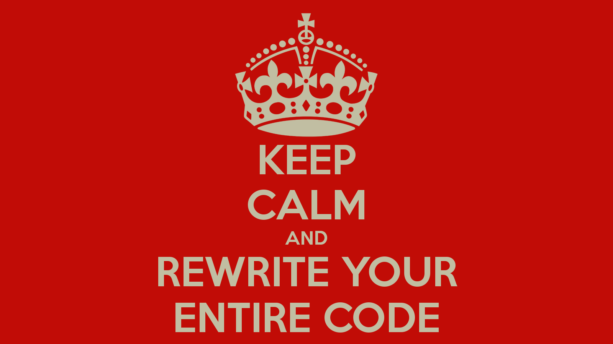

[🏠︎](README.md) ❭ Miscellaneous > Desktop Wallpaper

### The Documentation Project

  <picture>
    <source media="(prefers-color-scheme: dark)" srcset="../../../.github/repository/logo/apcp-logo-dark-256x256.png">
    <source media="(prefers-color-scheme: light)" srcset="../../../.github/repository/logo/apcp-logo-light-256x256.png">
    
  </picture>

 

***

[🏠︎](README.md) ❭ Miscellaneous > Desktop Wallpaper

Last updated: 260603
